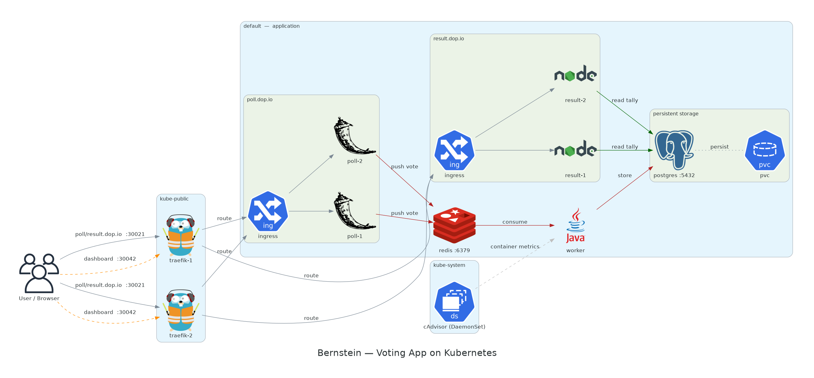
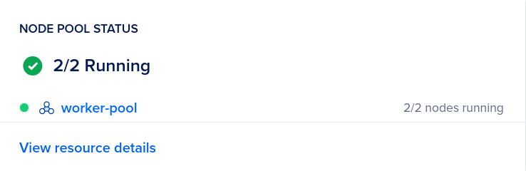
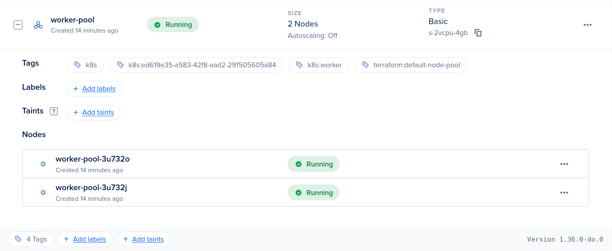
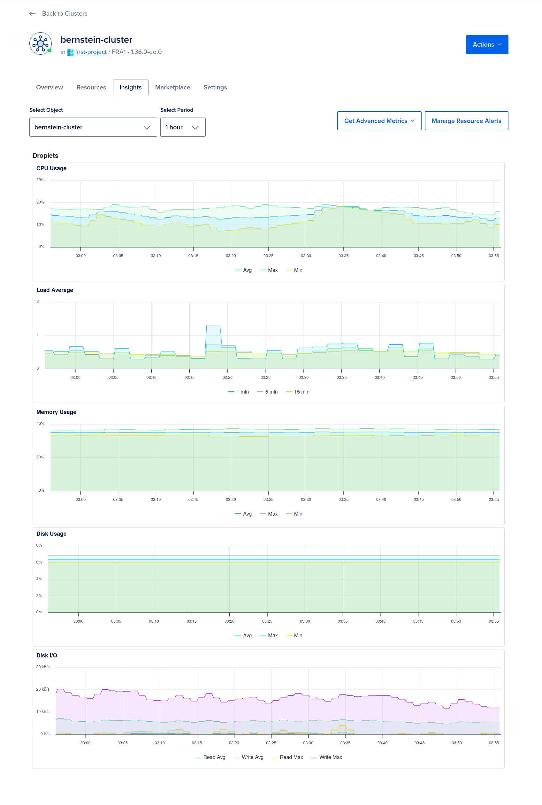
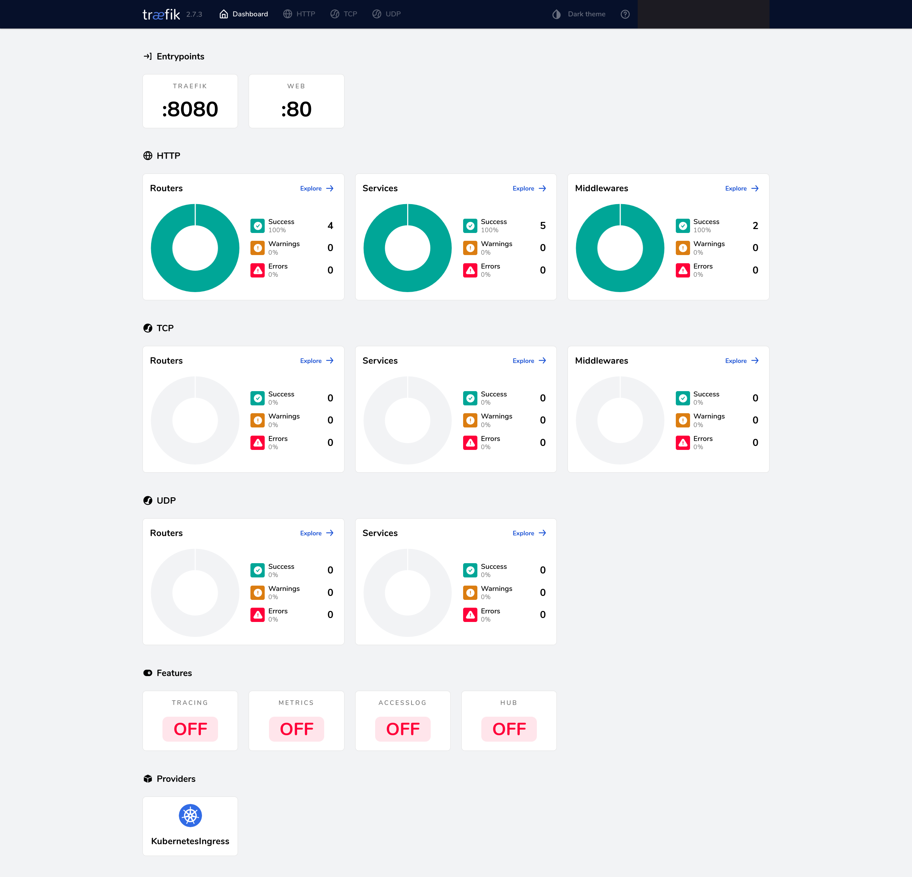

<div align="center">


# OpsWarden — Ops

<p>
  <a href="https://github.com/RomeoCavazza/opswarden-ops/actions/workflows/ops-ci.yml"></a>
  
  <a href="LICENSE"></a>
  
</p>

<br />

[](https://kubernetes.io/)
[](https://www.terraform.io/)
[](https://traefik.io/)
[](https://www.digitalocean.com/)
[](https://nixos.org/)

<br /><br />



<sub><i>Reference cluster topology — to be replaced by OpsWarden's own diagram.</i></sub>

</div>

<br />

---

## About

`opswarden-ops` is the **infrastructure & deployment** repository for OpsWarden:
a Kubernetes deployment on **DigitalOcean (DOKS)**, provisioned end-to-end by
**Terraform**, routed by **Traefik**, with a reproducible dev environment via
**Nix**.

It is **separate from the product** (`opswarden-app`) and **deliberately optional**:
OpsWarden runs with a single `docker compose up`. This repo is the **portfolio
cloud showcase** — it must never be a prerequisite to run or grade the product.

> Status: this repo is derived from a **proven reference deployment** (a working
> DOKS + Traefik + Postgres/Redis stack). The reusable infrastructure manifests
> are in place — their images modernized (Postgres 18 / Redis 8 / Traefik v3),
> pending re-validation on a live cluster — while the OpsWarden application
> services are **placeholders** until their images are published. Full re-targeting
> once the core + AI SRE are deployable. See the per-service status below.

---

## Project Structure

```
opswarden-ops/
│
├── k8s/
│   ├── server/             # OpsWarden server (Rust/Axum)  — placeholder
│   ├── client-web/         # Next.js client (or Vercel)    — placeholder
│   ├── investigation/      # AI SRE agent (RAG/FastAPI)     — placeholder
│   ├── worker/             # async Redis workers           — placeholder
│   ├── postgres/           # PostgreSQL                     — ready
│   ├── redis/              # Redis                          — ready
│   ├── traefik/            # ingress controller & LB        — ready
│   └── observability/      # cAdvisor (+ prom/grafana/loki) — partial
│
├── terraform/              # DOKS cluster provisioning (main/outputs/providers/variables.tf)
├── docs/                   # architecture + cluster screenshots
├── flake.nix / flake.lock  # Nix dev shell (kubectl, terraform, k9s, helm…)
├── .env                    # API tokens (git-ignored)
├── LICENSE / NOTICE        # Apache-2.0
└── README.md
```

---

## Services

| Service           |                                          Tech                                          | Status                                      |
| ----------------- | :------------------------------------------------------------------------------------: | ------------------------------------------- |
| **server**        |        Rust / Axum        | placeholder — `k8s/server/`                 |
| **client-web**    |         Next.js         | placeholder — `k8s/client-web/` (or Vercel) |
| **investigation** |     FastAPI (AI SRE)    | placeholder — `k8s/investigation/`          |
| **worker**        |                                         async                                          | placeholder — `k8s/worker/`                 |
| **PostgreSQL**    |  `postgres:18-alpine` | ready — `k8s/postgres/`                     |
| **Redis**         |     `redis:8-alpine`     | ready — `k8s/redis/`                        |
| **Traefik**       |                                     `traefik:v3.7`                                     | ready — `k8s/traefik/`                      |
| **cAdvisor**      |      monitoring     | ready — `k8s/observability/`                |

Replicated services use **pod anti-affinity** to land on different nodes.
Shared config lives in **ConfigMaps**; credentials in **Secrets** (rotate the
placeholder values before any real deployment).

---

## Reference Deployment

The reusable stack has been **proven on DigitalOcean Kubernetes (DOKS)** — a
2-node pool (`s-2vcpu-4gb`) provisioned end-to-end by Terraform in the `fra1`
region. The screenshots below are from that reference run; OpsWarden's own
screenshots will replace the application-level ones once it is deployed.

<div align="center">

**Node pool — 2 / 2 nodes running**



<br /><br />

**Worker pool detail — provisioned & tagged by Terraform**



<br /><br />

**Cluster insights — CPU, load, memory, disk & I/O**



<br /><br />

**Traefik — routers & services healthy, 100% success on `:80` / `:8080`**



</div>

> `docs/poll.png` and `docs/result.png` show the reference workload (a voting
> app) that validated the cluster end-to-end. They will be replaced by OpsWarden
> screenshots once the application services are deployed.

---

## Installation & Configuration

### Prerequisites

- [Nix](https://nixos.org/download.html) package manager
- A [DigitalOcean](https://www.digitalocean.com/) account with an API token
- [Git](https://git-scm.com/)

### 1 — Clone & enter the environment

```bash
git clone git@github.com:RomeoCavazza/opswarden-ops.git && cd opswarden-ops
cp .env.example .env   # add your DigitalOcean API token
nix develop            # loads kubectl, terraform, k9s, helm…
```

### 2 — Provision the cluster

```bash
cd terraform
terraform init
terraform apply        # creates a 2-worker DOKS cluster (~5 min)
cd ..
export KUBECONFIG=$(pwd)/kubeconfig
```

### 3 — Deploy the infrastructure layer

```bash
kubectl apply -f k8s/observability/cadvisor.daemonset.yaml
kubectl apply -f k8s/postgres/
kubectl apply -f k8s/redis/
kubectl apply -f k8s/traefik/
```

### 4 — Deploy the application layer

> The OpsWarden app services (`server`, `client-web`, `investigation`, `worker`)
> are **placeholders** for now. Once their images are published, fill the
> manifests in `k8s/<service>/` and apply them:

```bash
# kubectl apply -f k8s/server/
# kubectl apply -f k8s/client-web/
# kubectl apply -f k8s/investigation/
# kubectl apply -f k8s/worker/
```

### Teardown

```bash
cd terraform && terraform destroy
```

---

## License

OpsWarden is distributed under the **Apache License 2.0**. See
[LICENSE](LICENSE).
