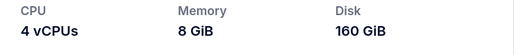
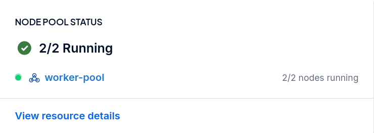
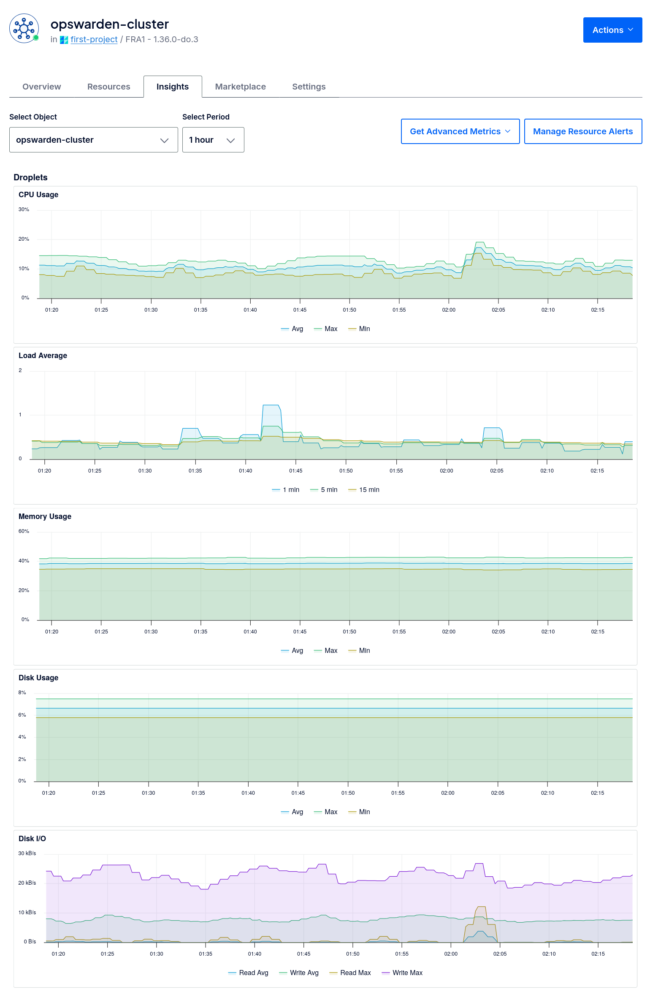
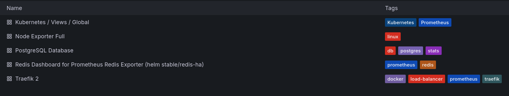
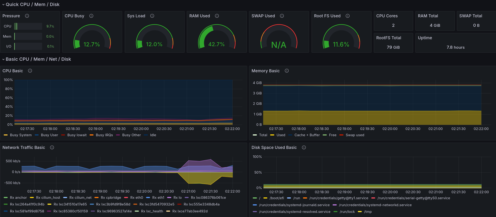
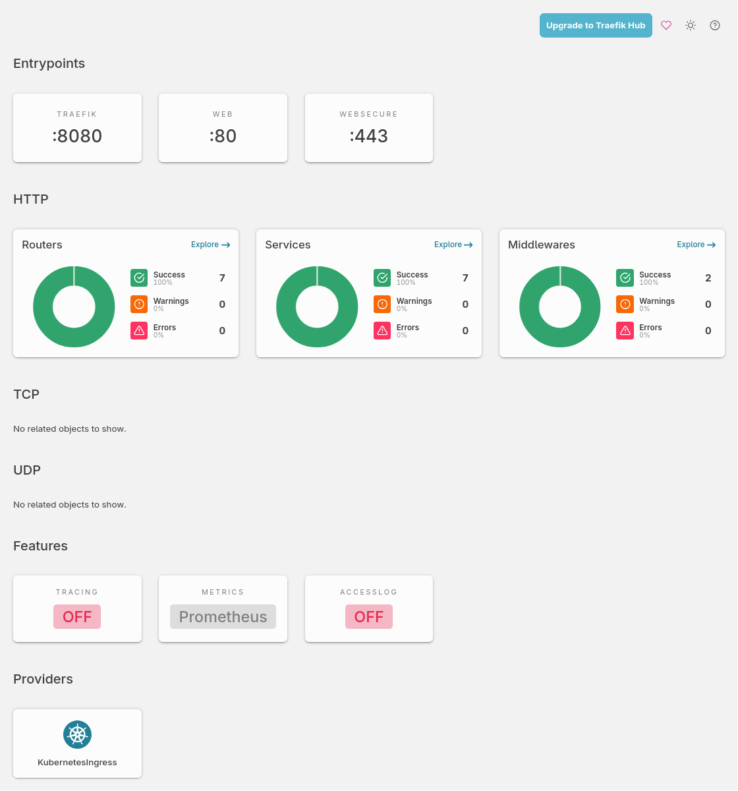
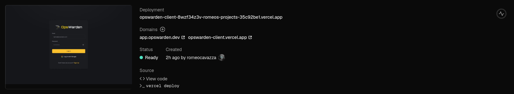

  
  <h1>OpsWarden - Infrastructure</h1>
  

    
    
    
    
    
    
    
    
  

This repository is the infrastructure and deployment home of OpsWarden, containing all our Cloud-Native provisioning and orchestration files.

It includes the **Terraform** configuration for our DigitalOcean Kubernetes cluster, our custom **Traefik** routing setup, the **Prometheus & Grafana** observability stack, and strict **Nix** environments for reproducible deployments.

## Behind the Scenes

While we keep our users focused on a clean and lightning-fast interface, the engine running OpsWarden is robust, observable, and fully declarative. Here is a tour of our real-world production deployment.

### Cloud Infrastructure

OpsWarden runs on a managed **DigitalOcean Kubernetes** cluster. We rely on managed node pools to handle horizontal scaling, with completely automated provisioning via Terraform.

  

  
  &nbsp;
  

### Observability & Metrics

Knowing the state of the cluster is critical. We capture hardware metrics, networking throughput, and container states, aggregating them into clear dashboards with Prometheus and Grafana.

  

  
  &nbsp;
  

### Ingress & Traffic Management

We use **Traefik** as our primary Ingress Controller, securely routing and load-balancing external HTTP and WebSocket traffic into the cluster.

  

### Edge Delivery

Our frontend is completely statically generated and served globally at the edge via **Vercel**, ensuring blazingly fast load times independently from the core cluster state.

  

